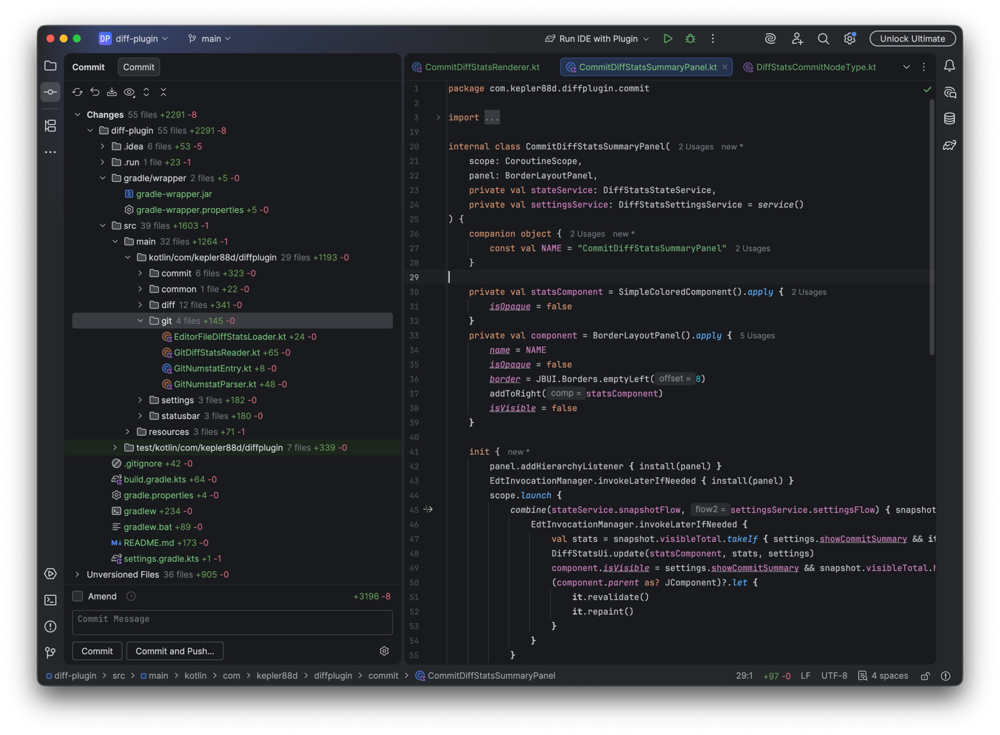

# Diffy

Diffy is an IntelliJ IDEA plugin that shows Git diff stats as inline `+N -M` counters across the IDE.

It is focused on answering a simple question quickly: how many lines were added and removed in the current change, folder, group, or file without opening a diff every time.

[](https://plugins.jetbrains.com/plugin/30695-diffy)



## What Diffy shows

Diffy renders colored diff stats in these places:

- Commit toolwindow tree
  - Files
  - Directories
  - Group rows such as `Changes` and `Unversioned Files`
- Commit status row
  - Total visible diff summary aligned to the right of the commit status panel
- Status bar
  - Current commit total
  - Current selection total while the commit tree is focused
  - Current editor file total when a changed file is selected in the editor
- Project view
  - Files
  - Directories
  - Group-like nodes such as project and module roots

Added counts use the configured green color. Removed counts use the configured red color.

new text
just dropped

## Supported IDE versions

Diffy is currently targeted at the IntelliJ Platform `253.*` line:

- `sinceBuild = 253`
- `untilBuild = 253.*`

In practice this means IntelliJ IDEA `2025.3.x`.

The project is built against IntelliJ IDEA `2025.3.1` and depends on the bundled `Git4Idea` plugin.

## Settings

Open:

`Settings | Tools | Diffy`

Available options:

- Colors
  - Added (`+`)
  - Removed (`-`)
- Locations
  - Status bar widget
  - Commit window
    - Files
    - Directories
    - Changes groups
    - Summary
  - Project view
    - Files
    - Directories
    - Groups

This lets you keep the plugin visible only where it is useful for your workflow.

## Current behavior and limitations

The current implementation is intentionally narrow:

- Git only
- Non-modal Commit toolwindow only
- Whole-file stats, not partial selection or partial hunk payloads
- No dedicated support for the modal commit dialog
- No dedicated support for Git staging-area mode
- Binary-only changes are hidden instead of rendering `+0 -0`
- Project view counters are aggregated from currently known local Git changes and unversioned files

Because the Commit toolwindow integration relies on IntelliJ internal VCS APIs, compatibility is pinned to the `253.*` platform line.

## Screens covered by the plugin

### Commit toolwindow

Diffy augments the commit changes tree with inline stats on:

- individual files
- directories
- change groups

It also shows a right-aligned total summary in the commit status row.

### Status bar

Diffy places a text-only widget near the line and column widgets. Depending on context, it shows:

- the selected commit-tree total
- the current commit total
- the currently selected editor file total

### Project view

Diffy decorates project tree nodes with aggregated stats so you can inspect impact from the file tree without opening the Commit toolwindow.

## Development

### Requirements

- JDK 21
- Gradle wrapper included in the repository

### Useful commands

Run the IDE with the plugin:

```bash
./gradlew runIde
```

Run tests:

```bash
./gradlew test
```

Run plugin verification:

```bash
./gradlew verifyPlugin
```

Build the distributable plugin ZIP:

```bash
./gradlew buildPlugin
```

## Project structure

Main source packages are organized by responsibility:

- `com.kepler88d.diffplugin.commit`
  - Commit toolwindow integration and summary UI
- `com.kepler88d.diffplugin.projectview`
  - Project view decorators and project-tree aggregation
- `com.kepler88d.diffplugin.statusbar`
  - Status bar widget and state display
- `com.kepler88d.diffplugin.git`
  - Git-backed diff-stat loading and editor-file helpers
- `com.kepler88d.diffplugin.diff`
  - Shared diff-stat models, aggregation, and rendering helpers
- `com.kepler88d.diffplugin.settings`
  - Persistent plugin settings and UI
- `com.kepler88d.diffplugin.common`
  - Shared bundle and common support code

Tests are located under `src/test/kotlin` and follow the same grouping.

## Implementation notes

- Written in Kotlin
- Uses the IntelliJ Platform Gradle Plugin
- Uses the bundled `Git4Idea` plugin for Git integration
- Uses project-scoped services to keep diff snapshots available to multiple UI surfaces

## Why this plugin exists

The default IntelliJ UI tells you which files changed, but not the size of each change at a glance. Diffy makes the magnitude of a change visible directly in the trees and toolbars you already use.
